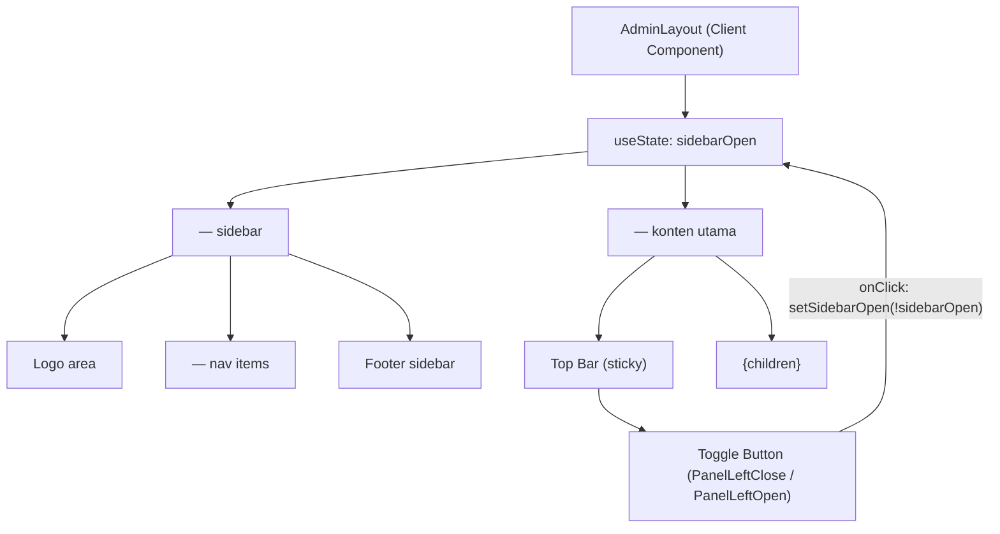

# Design Document — Admin Sidebar Toggle

## Overview

Fitur ini menambahkan kemampuan toggle buka/tutup pada sidebar navigasi admin di `src/app/admin/layout.tsx`. Seluruh implementasi berada dalam satu file — tidak ada file baru yang dibuat.

Perubahan inti:
- Menambahkan state `sidebarOpen: boolean` (default `true`) dengan `useState`
- Tombol toggle di Top Bar menukar state tersebut
- Sidebar menggunakan lebar `w-64` (expanded) atau `w-16` (collapsed) berdasarkan state
- Saat collapsed, hanya ikon nav yang tampil, dilengkapi Tooltip dari `@radix-ui/react-tooltip`
- CSS `transition` memastikan animasi lebar yang mulus

---

## Architecture

Karena seluruh fitur terlokalisir dalam satu komponen React Client, tidak ada perubahan arsitektur makro. `AdminLayout` tetap menjadi Client Component (`"use client"`) yang mem-wrap seluruh halaman admin. Penambahan satu `useState` cukup untuk mengontrol semua perilaku visual turunan.



---

## Components and Interfaces

### `AdminLayout` (modifikasi)

**File:** `src/app/admin/layout.tsx`

**State yang ditambahkan:**

```ts
const [sidebarOpen, setSidebarOpen] = useState(true);
```

**Import yang ditambahkan:**
- `useState` dari `react`
- `PanelLeftClose`, `PanelLeftOpen` dari `lucide-react`
- `Tooltip, TooltipContent, TooltipProvider, TooltipTrigger` dari `@radix-ui/react-tooltip`

**Props:** Tidak berubah — `{ children: React.ReactNode }`

---

### Toggle Button

Tombol ditempatkan di sisi kiri Top Bar, sebelum blok teks judul halaman. Menggunakan elemen `<button>` biasa dengan styling Tailwind konsisten dengan tema admin (warna zinc/orange).

```tsx
<button
  onClick={() => setSidebarOpen(!sidebarOpen)}
  aria-label={sidebarOpen ? 'Tutup sidebar' : 'Buka sidebar'}
  className="p-2 rounded-lg text-zinc-400 hover:text-orange-400 hover:bg-orange-500/10 transition-colors shrink-0"
>
  {sidebarOpen
    ? <PanelLeftClose className="w-5 h-5" />
    : <PanelLeftOpen  className="w-5 h-5" />}
</button>
```

---

### Sidebar (`<aside>`)

Lebar sidebar dikontrol oleh kelas Tailwind yang berganti berdasarkan `sidebarOpen`, dengan `transition-all duration-200` untuk animasi:

```tsx
<aside className={`
  ${sidebarOpen ? 'w-64' : 'w-16'}
  bg-[#140800] border-r border-orange-900/30
  flex flex-col shrink-0
  transition-all duration-200 overflow-hidden
`}>
```

**Logo area (expanded only):**
```tsx
{/* Teks "SeblakRR" dan "Admin Panel" hanya muncul saat sidebarOpen */}
{sidebarOpen && (
  <div>
    <h1 ...>SeblakRR</h1>
    <p ...>Admin Panel</p>
  </div>
)}
```

Logo "SR" (kotak oranye) selalu tampil di kedua kondisi, cukup dengan `mx-auto` saat collapsed untuk centering.

---

### Nav Items

Setiap item navigasi di-wrap dalam `TooltipProvider` + `Tooltip` dari `@radix-ui/react-tooltip`. Tooltip hanya aktif saat collapsed untuk menampilkan label item.

```tsx
<TooltipProvider delayDuration={0}>
  {navItems.map((item) => {
    const isActive = pathname === item.href;
    return (
      <Tooltip key={item.name}>
        <TooltipTrigger asChild>
          <Link
            href={item.href}
            className={`
              flex items-center rounded-xl transition-all group
              ${sidebarOpen ? 'gap-3 px-4 py-3' : 'justify-center p-3'}
              ${isActive
                ? 'bg-orange-600 text-white shadow-lg shadow-orange-900/50'
                : 'text-zinc-400 hover:bg-orange-500/10 hover:text-orange-400'}
            `}
          >
            <item.icon className={`w-5 h-5 shrink-0 ${isActive ? 'text-white' : 'text-zinc-500 group-hover:text-orange-400'}`} />
            {sidebarOpen && (
              <div className="flex-1 min-w-0">
                <p className={`font-bold text-sm truncate ${isActive ? 'text-white' : ''}`}>{item.name}</p>
                <p className={`text-[10px] truncate ${isActive ? 'text-orange-200' : 'text-zinc-600'}`}>{item.desc}</p>
              </div>
            )}
            {sidebarOpen && isActive && <ChevronRight className="w-4 h-4 text-white/60 shrink-0" />}
          </Link>
        </TooltipTrigger>
        {!sidebarOpen && (
          <TooltipContent side="right" className="bg-zinc-800 text-white text-xs border-zinc-700">
            {item.name}
          </TooltipContent>
        )}
      </Tooltip>
    );
  })}
</TooltipProvider>
```

**Minimum click target:** Padding `p-3` pada collapsed state memberikan area klik ≥ 44px (ikon 20px + padding 12px tiap sisi = 44px total).

---

### Footer Sidebar

Teks dan link footer disembunyikan saat collapsed:

```tsx
{sidebarOpen && (
  <>
    <Link href="/" target="_blank" ...>
      <ExternalLink ... /> Lihat Halaman User
    </Link>
    <p ...>Seblak RR © 2025 · Simulasi</p>
  </>
)}
```

Logo SR tetap tampil di collapsed footer area (atau bisa dihilangkan sepenuhnya karena sudah ada di header sidebar).

---

### Main Content (`<main>`)

Karena sidebar dan main keduanya berada dalam flex container, `flex-1` pada `<main>` sudah cukup untuk mengisi sisa lebar secara otomatis saat sidebar menyempit. Tidak perlu perubahan kelas pada `<main>`.

---

## Data Models

Fitur ini murni UI state — tidak ada perubahan data model, API, atau storage.

| State | Tipe | Default | Keterangan |
|---|---|---|---|
| `sidebarOpen` | `boolean` | `true` | Kondisi sidebar: `true` = expanded (w-64), `false` = collapsed (w-16) |

---

## Correctness Properties

*A property is a characteristic or behavior that should hold true across all valid executions of a system — essentially, a formal statement about what the system should do. Properties serve as the bridge between human-readable specifications and machine-verifiable correctness guarantees.*

### Property 1: Toggle adalah round-trip (idempotent-double-click)

*For any* nilai awal `sidebarOpen` (true atau false), mengklik Tombol_Toggle dua kali berturut-turut harus menghasilkan state `sidebarOpen` yang identik dengan nilai awal.

**Validates: Requirements 1.2, 1.3, 4.1**

---

### Property 2: Expanded state — semua nav item menampilkan name dan desc

*For any* array `navItems` yang valid (tiap item memiliki `name`, `desc`, `href`, `icon`), ketika `sidebarOpen = true`, setiap `item.name` dan `item.desc` harus muncul dalam output render komponen.

**Validates: Requirements 2.3**

---

### Property 3: Collapsed state — hanya ikon yang tampil, teks tersembunyi

*For any* array `navItems` yang valid, ketika `sidebarOpen = false`, tidak ada `item.name` maupun `item.desc` yang muncul sebagai teks terlihat dalam output render, namun elemen ikon (`item.icon`) untuk setiap item tetap ada di DOM.

**Validates: Requirements 3.1, 3.2**

---

### Property 4: Active item styling konsisten di kedua kondisi sidebar

*For any* pathname yang cocok persis dengan `href` salah satu nav item, item tersebut harus dirender dengan kelas aktif (`bg-orange-600`) — baik saat `sidebarOpen = true` maupun `sidebarOpen = false`. Untuk pathname yang tidak cocok dengan nav item manapun, tidak ada item yang boleh dirender dengan kelas aktif.

**Validates: Requirements 2.5, 5.3, 5.4**

---

### Property 5: Nav links tetap ada dan dapat diklik saat collapsed

*For any* nav item dalam `navItems`, ketika `sidebarOpen = false`, elemen `<a>` (Link) untuk item tersebut harus tetap ada dalam DOM dengan `href` yang benar, dan elemen induknya harus memiliki dimensi minimal 44×44px.

**Validates: Requirements 5.1, 5.2**

---

### Property 6: Semua elemen existing tetap hadir di semua kondisi sidebar

*For any* nilai `sidebarOpen` (true atau false), semua elemen berikut harus tetap ada dalam output render: logo SR, nav links (3 item), Top Bar, badge "Simulasi Aktif", dan `{children}`. Tidak ada elemen yang boleh hilang akibat perubahan state sidebar.

**Validates: Requirements 7.1, 7.5**

---

## Error Handling

| Skenario | Penanganan |
|---|---|
| `navItems` kosong | Nav render kosong; sidebar masih tampil dengan benar |
| `pathname` tidak cocok item manapun | Tidak ada item aktif; judul Top Bar fallback ke `'Dashboard'` (perilaku existing dipertahankan) |
| Error render Tooltip | `TooltipContent` gagal render tapi `TooltipTrigger` (Link) tetap fungsional; nav tidak terputus |
| `children` undefined/null | React menangani `null` children secara native; layout tidak rusak |

Tidak ada try/catch eksplisit yang diperlukan karena semua data (`navItems`) bersifat statis dan tidak ada I/O async dalam komponen ini.

---

## Testing Strategy

### Tooling

Proyek ini belum memiliki test runner. Rekomendasi:

- **Test runner & unit tests:** [Vitest](https://vitest.dev/) — zero-config dengan Next.js/TypeScript, API kompatibel Jest
- **Component rendering:** [React Testing Library](https://testing-library.com/docs/react-testing-library/intro/)
- **Property-based testing:** [fast-check](https://github.com/dubzzz/fast-check) — library PBT paling mature untuk ekosistem TypeScript/JavaScript

Instalasi:
```bash
npm install -D vitest @vitejs/plugin-react @testing-library/react @testing-library/jest-dom fast-check
```

---

### Unit Tests (Example-Based)

Fokus pada kasus konkret dan edge case yang tidak tercakup oleh property tests:

| Test | Assertion |
|---|---|
| Initial render | `sidebarOpen` = true; sidebar punya class `w-64` |
| Click toggle once | Sidebar berubah ke `w-16`; ikon berubah ke `PanelLeftOpen` |
| Click toggle twice | Sidebar kembali ke `w-64`; ikon kembali ke `PanelLeftClose` |
| Collapsed width | Sidebar memiliki class `w-16` |
| Toggle button position | Button berada sebelum elemen judul halaman dalam DOM |
| Expanded: logo visible | Teks "SeblakRR" dan "Admin Panel" ada di DOM |
| Collapsed: logo hidden | Teks "SeblakRR" dan "Admin Panel" tidak ada di DOM |
| Collapsed: footer hidden | "Lihat Halaman User" dan copyright tidak ada di DOM |
| Collapsed: footer present | Link dan copyright ada di DOM saat expanded |
| Sticky top bar | `<div>` Top Bar memiliki class `sticky top-0` |
| Transition class | `<aside>` memiliki class `transition-all` |

---

### Property-Based Tests

Setiap property test menggunakan fast-check dengan minimum **100 iterasi**. Setiap test diberi tag komentar referensi ke properti di dokumen ini.

#### Property 1: Toggle round-trip

```ts
// Feature: admin-sidebar-toggle, Property 1: Toggle adalah round-trip
fc.assert(fc.property(
  fc.boolean(), // initial sidebarOpen value
  (initialOpen) => {
    const { getByRole, rerender } = render(<AdminLayout>...</AdminLayout>);
    // Simulate two toggle clicks
    const btn = getByRole('button', { name: /sidebar/i });
    fireEvent.click(btn);
    fireEvent.click(btn);
    // State should be back to initial
    const aside = document.querySelector('aside');
    expect(aside).toHaveClass(initialOpen ? 'w-64' : 'w-16');
  }
), { numRuns: 100 });
```

#### Property 2: Expanded — semua nav item name & desc tampil

```ts
// Feature: admin-sidebar-toggle, Property 2: Expanded state nav items
fc.assert(fc.property(
  fc.array(fc.record({
    name: fc.string({ minLength: 1 }),
    desc: fc.string({ minLength: 1 }),
    href: fc.webPath(),
    icon: fc.constant(LayoutDashboard), // icon component
  }), { minLength: 1, maxLength: 10 }),
  (navItems) => {
    const { getByText } = renderWithNavItems(navItems, true);
    for (const item of navItems) {
      expect(getByText(item.name)).toBeVisible();
      expect(getByText(item.desc)).toBeVisible();
    }
  }
), { numRuns: 100 });
```

#### Property 3: Collapsed — teks nav tersembunyi, ikon tetap ada

```ts
// Feature: admin-sidebar-toggle, Property 3: Collapsed state nav items
fc.assert(fc.property(
  fc.array(fc.record({
    name: fc.string({ minLength: 1 }),
    desc: fc.string({ minLength: 1 }),
    href: fc.webPath(),
    icon: fc.constant(LayoutDashboard),
  }), { minLength: 1, maxLength: 10 }),
  (navItems) => {
    const { queryByText, container } = renderWithNavItems(navItems, false);
    for (const item of navItems) {
      expect(queryByText(item.name)).not.toBeVisible(); // hidden or absent
      expect(queryByText(item.desc)).not.toBeVisible();
    }
    // Icons still present (svg elements inside links)
    const links = container.querySelectorAll('nav a');
    expect(links.length).toBe(navItems.length);
  }
), { numRuns: 100 });
```

#### Property 4: Active item styling konsisten

```ts
// Feature: admin-sidebar-toggle, Property 4: Active item styling
fc.assert(fc.property(
  fc.constantFrom('/admin', '/admin/orders', '/admin/menu', '/admin/other'),
  fc.boolean(),
  (pathname, isOpen) => {
    const { container } = renderWithPathname(pathname, isOpen);
    const links = container.querySelectorAll('nav a');
    const activeLinks = Array.from(links).filter(l =>
      l.classList.contains('bg-orange-600')
    );
    const matchingItems = navItems.filter(n => n.href === pathname);
    expect(activeLinks.length).toBe(matchingItems.length);
  }
), { numRuns: 100 });
```

#### Property 5: Nav links ada dan dapat diklik saat collapsed

```ts
// Feature: admin-sidebar-toggle, Property 5: Nav links clickable when collapsed
fc.assert(fc.property(
  fc.array(fc.record({
    name: fc.string({ minLength: 1 }),
    href: fc.webPath(),
    icon: fc.constant(LayoutDashboard),
    desc: fc.string(),
  }), { minLength: 1, maxLength: 10 }),
  (navItems) => {
    const { container } = renderWithNavItems(navItems, false);
    const links = container.querySelectorAll('nav a');
    links.forEach(link => {
      expect(link).toBeInTheDocument();
      const rect = link.getBoundingClientRect();
      expect(rect.width).toBeGreaterThanOrEqual(44);
      expect(rect.height).toBeGreaterThanOrEqual(44);
    });
  }
), { numRuns: 100 });
```

#### Property 6: Elemen existing tetap hadir di semua kondisi

```ts
// Feature: admin-sidebar-toggle, Property 6: Existing elements preserved
fc.assert(fc.property(
  fc.boolean(),
  fc.string({ minLength: 1 }), // arbitrary children content
  (isOpen, childContent) => {
    const { getByText, container } = render(
      <AdminLayout>{childContent}</AdminLayout>,
      { sidebarOpen: isOpen }
    );
    expect(container.querySelector('aside')).toBeInTheDocument();
    expect(getByText('SR')).toBeInTheDocument();
    expect(container.querySelectorAll('nav a').length).toBe(3);
    expect(getByText('Simulasi Aktif')).toBeInTheDocument();
    expect(getByText(childContent)).toBeInTheDocument();
  }
), { numRuns: 100 });
```

---

### Integration / Smoke Tests

| Test | Tipe | Keterangan |
|---|---|---|
| Tooltip muncul saat hover ikon collapsed | Smoke/E2E | Memerlukan browser; verifikasi manual atau Playwright |
| CSS transition terlihat smooth di browser | Smoke | Verifikasi manual |
| Toggle button tidak tertimpa elemen lain | Smoke | Verifikasi manual di berbagai viewport |
| Navigasi ke `/admin/orders` tidak mereset state sidebar | Integration | Render dengan router mock, navigate, assert state unchanged |
